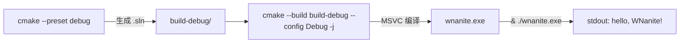
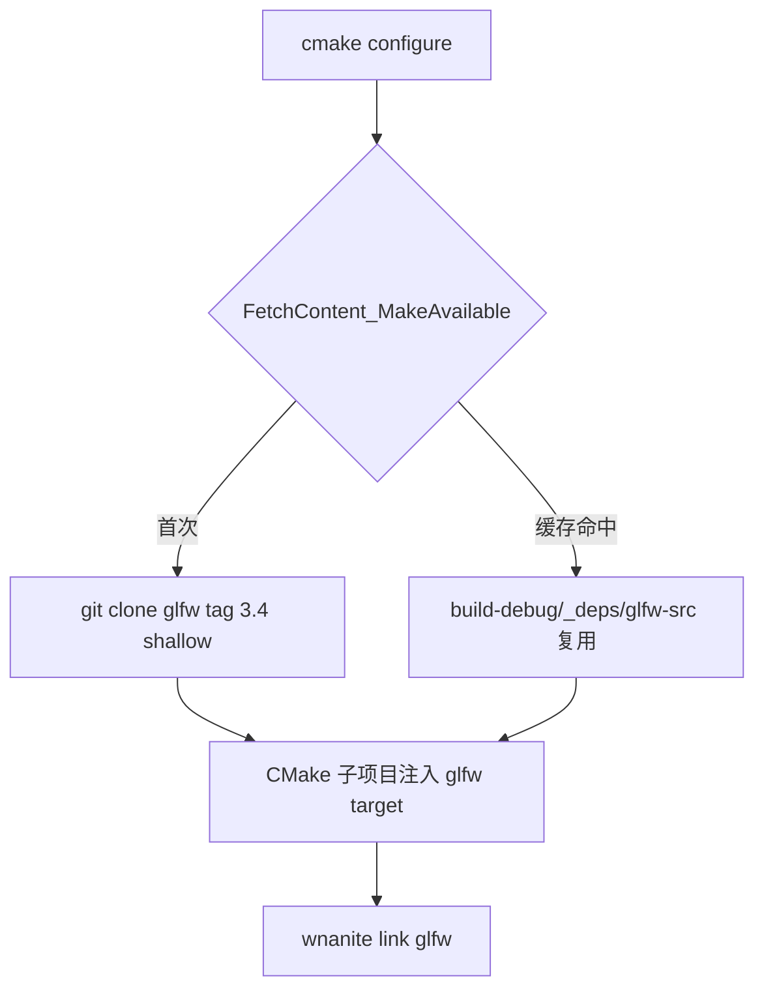

# 从零写 DX12 Nanite 沙盒 (1)：CMake 骨架 + 引入 GLFW

> WNanite 是我新开的学习项目：**从零写一个 DX12 沙盒，复刻 UE5 Nanite 的大部分流程**。整套计划拆成 7 个子项目、46 个原子学习步骤，每步 < 1 小时，跑得通就提交、写笔记、再走下一步。这篇是 Phase A · Bootstrap 的前两步：搭好 CMake 骨架、引入 GLFW。

---

## 为什么是 WNanite

Nanite 是 UE5 最具野心的渲染特性之一——cluster DAG、software rasterizer、virtual geometry streaming——是一个把现代 GPU 能力榨干的复合系统。直接读 UE5 源码当然可以，但 UE 体量太大、RHI/RDG 抽象层太多，对"理解 Nanite 本身"反而是噪声。

所以我决定**独立写一个 DX12 沙盒**，把 UE5 Nanite 的核心思路从零复刻一遍。目标永远是 **理解 > 速度 > 性能**——不是产品级渲染器，是一个能让自己拆开看清楚每一步的学习载体。

整体被拆成 7 个子项目：

```
子项目 0：Harness（本系列）         ─── 46 步搭起 DX12 + RDG + Bindless 基础
子项目 1：Cooker + Cluster 构建     ─── glTF → meshlet → DAG
子项目 2：Cluster MVP（HW Raster）  ─── 两级 culling + HZB occlusion
子项目 3：SW Rasterizer             ─── persistent thread + 64-bit visbuffer
子项目 4：Visibility Buffer Shading
子项目 5：LOD + DAG 遍历
子项目 6：Streaming / Virtual Geometry
```

子项目 0 是本系列的全部内容——这是个**地基**，没有它后面任何一个子项目都跑不起来。

子项目 0 的 46 步又分成 11 个 Phase。本文覆盖 Phase A 的第 1、第 2 步——把项目骨架立起来、把第一个第三方依赖（GLFW）接进来。听起来不性感，但学习项目的乐趣本来就藏在"为什么是这样写"的每一个细节里。

---

## 整体技术选型，一次说清

每个决定都问"为什么"：

| 维度 | 选 | 为什么 |
|---|---|---|
| 图形 API | DX12 | Nanite 在 UE5 里就是 DX12 路径主力；Vulkan 也行但 RDC/PIX 调试生态偏 DX12 |
| 平台 | Windows 11 only | DX12 不跨平台 |
| 构建 | CMake ≥ 3.25 | 跨 IDE 通吃，FetchContent 让第三方依赖单源真理 |
| 编译器 | MSVC（VS 2022） | DX12 原生工具链 |
| C++ 标准 | C++20 | concepts / ranges / consteval 让 RDG 和 Bindless 的模板代码可读 |
| Shader Model | 6.6 | Nanite 的最低门槛：Bindless ResourceDescriptorHeap + AtomicInt64 + wave ops 都到位 |
| 窗口/输入 | GLFW | 短路径，把精力留给 Nanite 本身 |
| 内存分配 | D3D12MemoryAllocator | AMD 官方，生产级 |
| Shader 编译 | DXC | SM 6.6+ 必须 |
| Mesh 加载 | cgltf | 单头文件、零依赖 |
| UI | Dear ImGui | 事实标准 |

技术栈定下来后，写代码就是按这套地图填坑。

---

## 步骤 01：CMake 最小骨架

### 文件就两个

```
WNanite/
  CMakeLists.txt
  CMakePresets.json
  src/
    main.cpp
```

`src/main.cpp` 只做一件事——`printf("hello, WNanite!\n")`。这步**不引入任何第三方依赖、不引入 DX12**，纯粹打骨架。

为什么这么克制？因为学习项目的核心是**每一步都能复盘**。如果第一步就把 GLFW + DX12 + ImGui 全接进来，编译出错时根本不知道在哪一环。把这步切到只剩 CMake 本身，下次再有 CMake 问题，唯一变量就是 CMake 配置——没有干扰项。

### CMakeLists.txt 逐行讲

```cmake
cmake_minimum_required(VERSION 3.25)

project(WNanite
    LANGUAGES CXX
    DESCRIPTION "DX12 Nanite-style learning sandbox"
)

# === 全局 C++ 标准 ===
set(CMAKE_CXX_STANDARD          20)
set(CMAKE_CXX_STANDARD_REQUIRED ON)
set(CMAKE_CXX_EXTENSIONS        OFF)

# === MSVC 专属编译选项 ===
if(MSVC)
    add_compile_options(
        /W4
        /utf-8
        /Zc:__cplusplus
        /Zc:preprocessor
        /permissive-
    )
endif()

# === 可执行目标 ===
add_executable(wnanite
    src/main.cpp
)
```

四个值得注意的细节：

**1. `cmake_minimum_required(VERSION 3.25)`**
3.25 是 `FetchContent` 加 `SYSTEM` 标记的起点（步骤 02 会用到），也是 CMake Presets v6 的需求。

**2. `set(CMAKE_CXX_EXTENSIONS OFF)`**
关掉编译器扩展，强制标准 C++。这是个**长期收益**的决定：写 MSVC 才有的扩展会导致代码可移植性变差，也会让一些 sanitizer / clang-tidy 检查失效。

**3. MSVC 的五个编译选项**

- `/W4`：警告级别拉到次高（最高 `/Wall` 噪声太大）。学习项目要尽早暴露问题。
- `/utf-8`：源文件按 UTF-8 解析。本仓库注释大量中文，**必须**显式声明，否则 MSVC 默认会按系统 ANSI 代码页解析。
- `/Zc:__cplusplus`：MSVC 默认 `__cplusplus == 199711L`（历史遗留），这个开关才让 `__cplusplus` 反映真实的 `202002L`（C++20）。这个坑很多人踩。
- `/Zc:preprocessor`：启用符合标准的预处理器。旧的 MSVC 预处理器对宏展开有些非标行为，会让 cross-compiler 代码翻车。
- `/permissive-`：拒绝非标准扩展，写更可移植的代码。

**4. 单一可执行目标**
没有建 `src/Core/`、`src/RHI/` 等子目录——**YAGNI**。等真的需要分模块的时候（步骤 ≥ 03）再拆。学习项目不要预先抽象。

### CMakePresets.json：把 IDE 配置标准化

```json
{
  "version": 6,
  "configurePresets": [
    {
      "name": "debug",
      "generator": "Visual Studio 17 2022",
      "binaryDir": "${sourceDir}/build-debug",
      "cacheVariables": {
        "CMAKE_CONFIGURATION_TYPES": "Debug"
      }
    },
    {
      "name": "release",
      "generator": "Visual Studio 17 2022",
      "binaryDir": "${sourceDir}/build-release",
      "cacheVariables": {
        "CMAKE_CONFIGURATION_TYPES": "Release"
      }
    }
  ]
}
```

为什么用 preset 不直接 `cmake -B build-debug -G "Visual Studio 17 2022" -DCMAKE_BUILD_TYPE=Debug` 一长串？

- 一句话 `cmake --preset debug` 搞定
- CI / agent / VS Code / Rider / CLion 全部认这个文件
- 团队不用为"该怎么配置 cmake"扯皮

**注意**：用的是 `CMAKE_CONFIGURATION_TYPES` 而不是 `CMAKE_BUILD_TYPE`。**Visual Studio 是 multi-config generator**，每个 build 目录里 Debug / Release 并存，build 时再选——`CMAKE_BUILD_TYPE` 在 VS generator 下是无效的。这又是一个常见坑。

### 构建流程



跑完两条命令就拿到 `hello, WNanite!`。Debug 和 Release 各跑一遍，确认两套都通——一上来就同时验证两个 config 能省后面很多事。

### 踩过的坑

- **`/W4` 下 `int main()` 没事，但写 `int main(int argc, char* argv[])` 时 MSVC 会要求精确签名**——后面引入命令行解析时要留意
- **VS 2022 generator 找不到**——必须装好 VS 2022（CMake 通过注册表探测）；纯命令行环境可以用 `-G Ninja` 替代
- **PowerShell 调 exe 必须用 `&`**——`& E:\path\wnanite.exe`，否则被 PS 当字符串解析

---

## 步骤 02：引入 GLFW

第二步引入第一个第三方库——GLFW。但**仅验证链接通畅 + 运行时能调**，不开窗口（窗口留给步骤 03）。

### 为什么 FetchContent，不是 vcpkg



- **单源真理**：所有第三方依赖都在 `CMakeLists.txt` 里声明，看一处就懂
- **零预安装**：用户不用先装 vcpkg / conan
- **可复现**：tag 钉死在 3.4
- **同模式扩展**：后面 DXC / cgltf / D3D12MA / imgui / spdlog 全套同模式

### 改动只有两块

**CMakeLists.txt 新增 18 行**（在 `add_executable` 前后插入）：

```cmake
# === 第三方依赖（FetchContent） ===
include(FetchContent)

# --- GLFW 3.4 ---
set(GLFW_BUILD_DOCS     OFF CACHE BOOL "" FORCE)
set(GLFW_BUILD_EXAMPLES OFF CACHE BOOL "" FORCE)
set(GLFW_BUILD_TESTS    OFF CACHE BOOL "" FORCE)
set(GLFW_INSTALL        OFF CACHE BOOL "" FORCE)

FetchContent_Declare(
    glfw
    GIT_REPOSITORY https://github.com/glfw/glfw.git
    GIT_TAG        3.4
    GIT_SHALLOW    TRUE
    SYSTEM
)
FetchContent_MakeAvailable(glfw)

# ... add_executable(wnanite src/main.cpp) ...

target_link_libraries(wnanite PRIVATE glfw)
```

**`src/main.cpp` 增加 GLFW 三调用**：

```cpp
#include <GLFW/glfw3.h>
#include <cstdio>

int main()
{
    std::printf("hello, WNanite!\n");

    if (!glfwInit())
    {
        std::printf("glfwInit failed\n");
        return 1;
    }
    std::printf("GLFW %s\n", glfwGetVersionString());
    glfwTerminate();
    return 0;
}
```

跑完：

```
hello, WNanite!
GLFW 3.4.0 Win32 WGL Null EGL OSMesa VisualC
```

### 几个关键决定的为什么

**1. 钉 tag `3.4`，不钉 SHA、不跟 main**
- 3.4 是 2024-02 的最新稳定 release
- 学习项目可复现性 > 跟最新
- SHA 太严，main 太松，tag 刚好

**2. 关掉 GLFW 的 docs / examples / tests / install**
- 配置时间从 ~40 秒降到 ~20 秒
- IDE solution explorer 不被一堆无关 target 污染
- 这套写法（`CACHE BOOL "" FORCE`）适用于几乎所有 CMake-based 第三方

**3. `SYSTEM` 标记（CMake 3.25+）**

GLFW 头文件在 `/W4 /permissive-` 下会产生若干警告（macro 中的强制转换、padding 等）。`SYSTEM` 让消费者把这些头视作系统头，警告被静音；我们自己写的 `main.cpp` 仍按严格 `/W4` 检查。

```cmake
FetchContent_Declare(
    glfw
    ...
    SYSTEM      # ← 这一行让 GLFW 警告不污染我们
)
```

**4. `target_link_libraries(wnanite PRIVATE glfw)`**

`wnanite` 是叶子 executable，没有别的 target 继承它的链接需求。`PRIVATE` 表达"GLFW 是我的内部依赖，外部不见"。规模大了之后这种链接可见性管理至关重要。

**5. 调一次 `glfwInit` + 拿版本字符串，不是只 link**

链接通过只能证明符号在；不能证明运行时能加载。调一次 `glfwInit` + 拿到非空版本串 = 完整端到端活性证据。多一行 stdout 也是给 agent 自验证留信号——后面步骤 20+ 引入 headless + 截图后，agent 能自动 diff 这个版本号。

### 踩过的坑

- **`FetchContent_MakeAvailable` 没有 EXCLUDE_FROM_ALL**——GLFW 的 target 会出现在 IDE solution，但因为 docs/examples/tests 都关了，扰动最小
- **首次 configure 慢**——FetchContent 默认会克隆完整 git 历史；`GIT_SHALLOW TRUE` 只拉 tag 的 tip commit，配置时间从 ~40s 降到 ~10s
- **多 preset 各自克隆一份**——`build-debug/_deps/glfw-src/` 与 `build-release/_deps/glfw-src/` 各自独立。可以用 `FETCHCONTENT_BASE_DIR` 合并，但学习项目暂不做
- **GLFW 触发 C 编译器探测 + pthread 测试**——GLFW 内部用 C 写，CMake 会探测 MSVC 的 C 编译器并跑 `pthread` 探测。Windows 上 pthread 自然找不到（Win32 Thread API 替代），属正常输出，不要被吓到

---

## 与 UE5 的对照

GLFW 在 UE5 里没有直接对应——UE5 自己写跨平台 Application 抽象：

| 角色 | GLFW | UE5 |
|---|---|---|
| 全局初始化 | `glfwInit()` | `FPlatformApplicationMisc::CreateApplication()` |
| 平台抽象 | （没有，单一全局状态机） | `FGenericApplication` 基类 |
| Windows 实现 | `src/win32_init.c` | `FWindowsApplication`（`Engine/Source/Runtime/ApplicationCore/Private/Windows/`） |
| 消息泵 | `glfwPollEvents()` | `FGenericApplication::PumpMessages()` |
| 主循环 | 用户自己 `while(!glfwWindowShouldClose)` | `FEngineLoop` 替你 pump |

UE 的 `WindowsApplication.cpp` 比 GLFW 重得多：HiDPI、IME、Touch、Tablet、Accessibility 全包。但本质都是 Win32 `RegisterClassEx` + `CreateWindowEx` + `GetMessage` 那一套。

WNanite 选 GLFW 的理由：学习项目要短路径。UE 那套抽象层级在我们这个规模下属于过度设计；真要复刻 UE 风格的 Slate / Application 时（不会很快），可以回头看 `WindowsApplication.cpp`。

---

## 一些反思：学习项目为什么要这么"慢"

第一篇文章覆盖的实际工作量——两个 commit、两个 README、两个 step-NN——可能在工程师视角里属于"半小时活"。但我花了几倍时间。原因：

**1. 每一行配置都问"为什么"**
学习项目最大的杀手是"复制粘贴一段能跑就行"。如果两年后回来看 `CMakeLists.txt` 第 17 行 `/Zc:__cplusplus`，自己都不知道为什么写——那这段配置就是 dead context，删了不敢删，留了没意义。

**2. 每一步都先写设计文档**
Phase A 的 11 步全在一份 `harness-design.md` 里锁好；每一具体步骤再有自己的 step-NN spec。不写文档的代码很容易越写越偏。写文档逼自己想清楚"这一步要解决什么、不解决什么"。

**3. 每一步都强制 README + UE5 对照 + 踩过的坑**
README 七节模板（学了什么 / 为什么 / 代码导读 / UE5 对照 / 截图 / 坑 / 下一步预告）听起来像形式主义，但它强制把不同维度的知识都过一遍。"踩过的坑"那一节尤其值钱——每一条都是实际编译/运行/调试时发生的，是别人读源码也看不到的隐性知识。

**4. 步骤切到 1 小时以内**
46 步覆盖完整 harness，每步 < 1 小时——这意味着每天可以推进 2-3 步，每步都跑得通，都可见进度。比"花两周搭完整 harness 然后不知道哪一环坏了"健康得多。

---

## 下一篇预告

**步骤 03：GLFW 窗口生命周期 + 事件循环**

- `glfwCreateWindow` 出一个真实窗口
- `while(!glfwWindowShouldClose) { glfwPollEvents(); }`
- 关闭按钮可终止、窗口可改大小
- 仍不接 DX12（DX12 留给步 04+：DXGI Factory + Adapter 枚举开始）

---

> 本项目地址：[github.com/wlxklyh/WNanite](https://github.com/wlxklyh/WNanite)
> 本文对应 commits：`ec6e46c` (init) / `03fc58f` (step-01) / `34aa671` (step-02)
> 系列计划：46 步搭 harness（子项目 0）→ 6 个子项目复刻 UE5 Nanite 主路径
> 每步 < 1 小时，跑通就提交，慢工出细活
